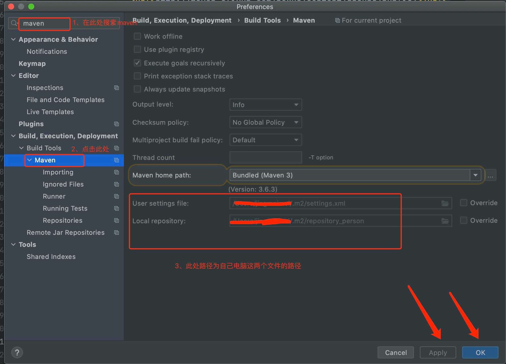
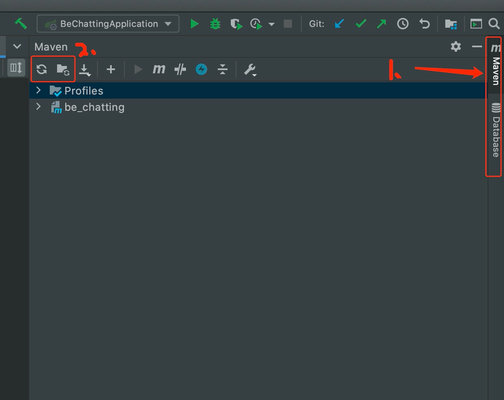

# BE_chatting
社交网站的后端代码

# 项目运行
1. 下载安装jdk 

***在官网下载jdk8***

https://www.oracle.com/java/technologies/javase/javase-jdk8-downloads.html

windows电脑：```jdk-8u202-windows-x64z``` 

mac电脑可自行选择相关版本下载

2. 安装Homebrew

在命令行上输入： ```/bin/bash -c "$(curl -fsSL https://raw.githubusercontent.com/Homebrew/install/master/install.sh)"```

这个过程很慢。。。。

3. 下载安装maven

***以下为mac电脑安装方式，与windows的别无差异。***
```html
（1) brew install maven   
 (2) mkdir -p ~/.m2/
 (3) 在~/.m2/ 目录下创建 settings.xml文件和repository文件夹   
(4) 将以下内容复制到settings.xml中 ,注意```<localRepository>这里为自己的repository文件夹路径</localRepository>```
```
 ```html
<?xml version="1.0" encoding="UTF-8"?>
<settings xmlns:xsi="http://www.w3.org/2001/XMLSchema-instance" xmlns="http://maven.apache.org/SETTINGS/1.0.0"
          xsi:schemaLocation="http://maven.apache.org/SETTINGS/1.0.0 http://maven.apache.org/xsd/settings-1.0.0.xsd">
   
    <localRepository>/Users/xxx/.m2/repository_person</localRepository>

    <mirrors>
	<mirror>	
	    <id>alimaven</id>
            <mirrorOf>*</mirrorOf>
            <name>aliyun maven</name>
            <url>http://maven.aliyun.com/nexus/content/groups/public</url>
       </mirror>
    </mirrors>

    <profiles>
         <profile>
            <id>ali</id>
            <repositories>
                <repository>
                    <id>alimaven</id>
                    <name>aliyun maven</name>
                    <url>http://maven.aliyun.com/nexus/content/groups/public/</url>
                    <releases>
                        <enabled>true</enabled>
                    </releases>
                    <snapshots>
                        <enabled>true</enabled>
                    </snapshots>
                </repository>
            </repositories>
            <pluginRepositories>
                <pluginRepository>
                    <id>alimaven</id>
                    <name>aliyun maven</name>
                    <url>http://maven.aliyun.com/nexus/content/groups/public/</url>
                </pluginRepository>
            </pluginRepositories>
    	</profile>
    </profiles>

    <activeProfiles>
        <activeProfile>ali</activeProfile>
    </activeProfiles>

</settings>
```
(5) 下载项目，用idea打开，在idea中配置maven。

(6) 加载项目的maven

(7) 运行BeChattingApplicationTests类
